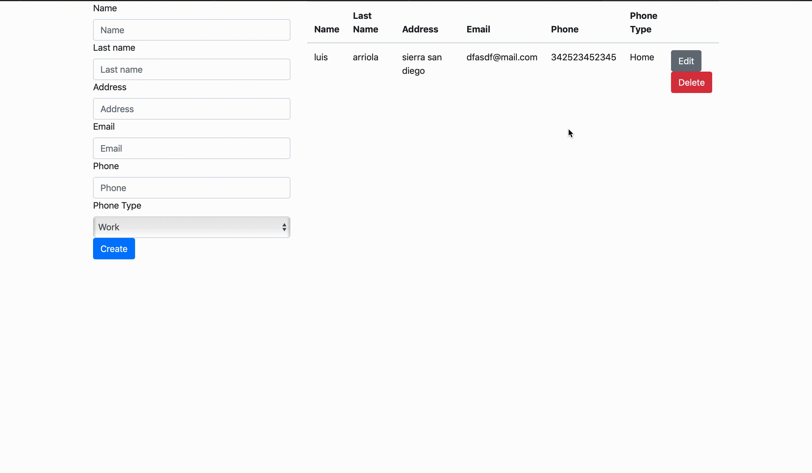
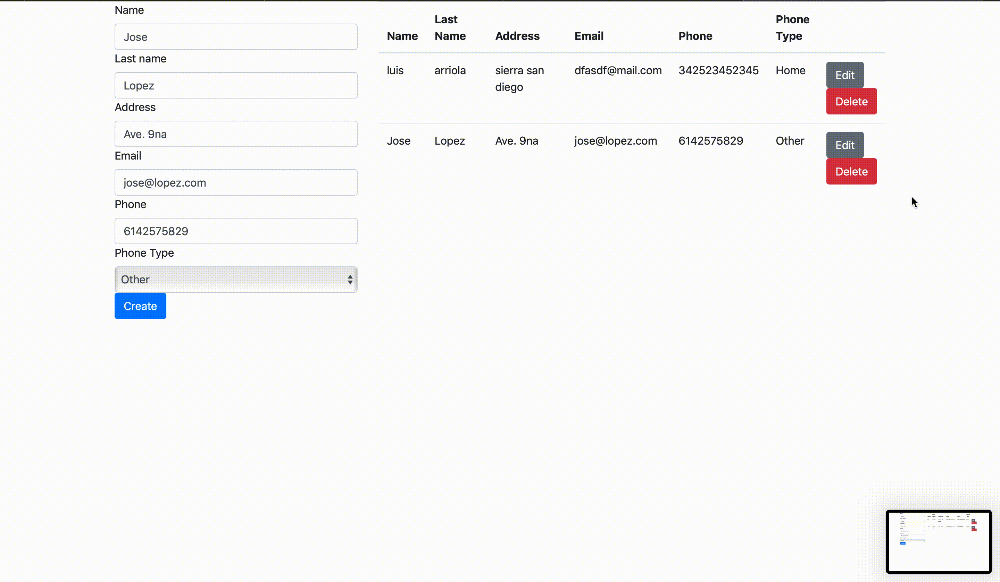

# Agenda Node JS

## Advantages and disadvantages of the programming language.
## Advantages and disadvantages of the web application framework/stack.
## More common technologies ued with the platform/framework
## Most popular IDEs
## What type of applications the framework is best suited for?
## GIFs
### Create

### Read

### Update

### Delete

