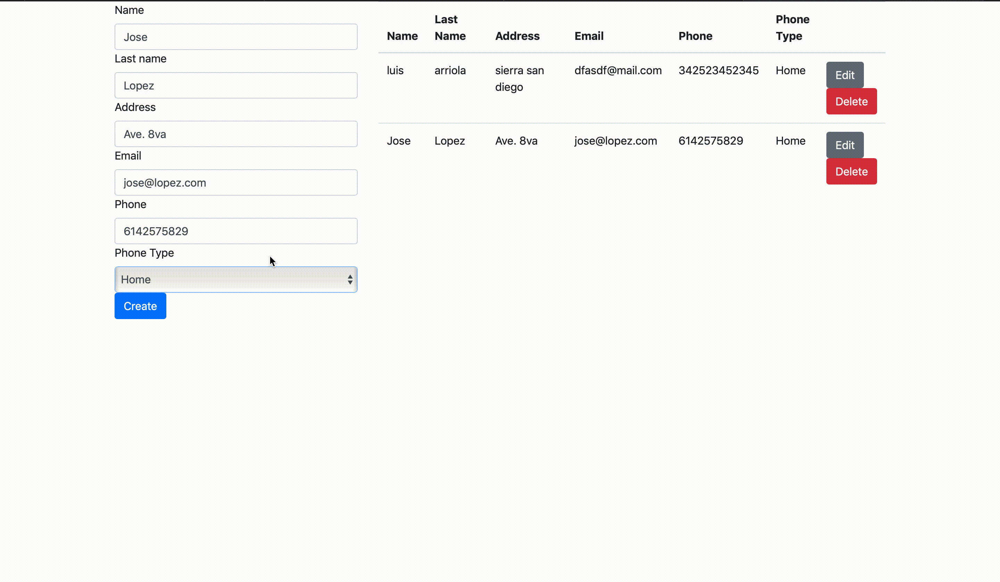

# Agenda Node JS

## Advantages and disadvantages of the programming language.

### Advantages

- It can be used both in the frontend and in the backend.
- Can take advantage of NPM.

### Disadvantages

- CPU intensive.
- Underdeveloped tools for relational databases.

## Advantages and disadvantages of the web application framework/stack.

### Advantages

- Javascript is the only language needed for the stack. 
- Highly flexible: You can test your app even during the development process, and host it on the cloud.
- Scalable:all code is separated in MEAN.

### Disadvantages

- Security exploits: the stack is still considered less safe from a data security standpoint. The fact that the oldest core software within the architecture is only ten years old at best, this means MEAN will be a prime target for hackers looking to take advantage of its relative youth.
- No SQL:  Relational databases are still  more reliable and stable.

## Most common technologies used with the platform/framework

- MongoDB : document-oriented database program.
- Express.js : robust tooling for HTTP servers.
- AngularJS :  front-end web framework mainly maintained by Google.

## Most popular IDEs

- InteliJ WebStorm: powerful IDE with a assistance for writing code in JS.
- Brackets: an open-source project started by Adobe systems.
- Eclipse: famous for Java development. It has a plugins for almost any lanaguage.
- SublimeText: minimal yet functional. 

## What type of applications the framework is best suited for?

For organizations that prefer to use only one language in the whole project. Also it is best suited for projects that require a no relational database. Because the usage of adblockers is growing in website users, MEAN is not recommended if the inteded user is in said segment. 

## GIFs

### Create

### Read

### Update

### Delete

## Sources

https://www.software-developer-india.com/advantages-and-disadvantages-of-node-js/

https://jaxenter.com/top-5-ides-node-js-147667.html

https://codecondo.com/best-ide-for-node-js/

https://en.wikipedia.org/wiki/MEAN_(software_bundle)

https://www.bizepic.com/2018/07/14/mean-stack-for-app-development-the-pros-and-cons/

https://www.software-developer-india.com/advantages-and-disadvantages-of-the-mean-stack/
